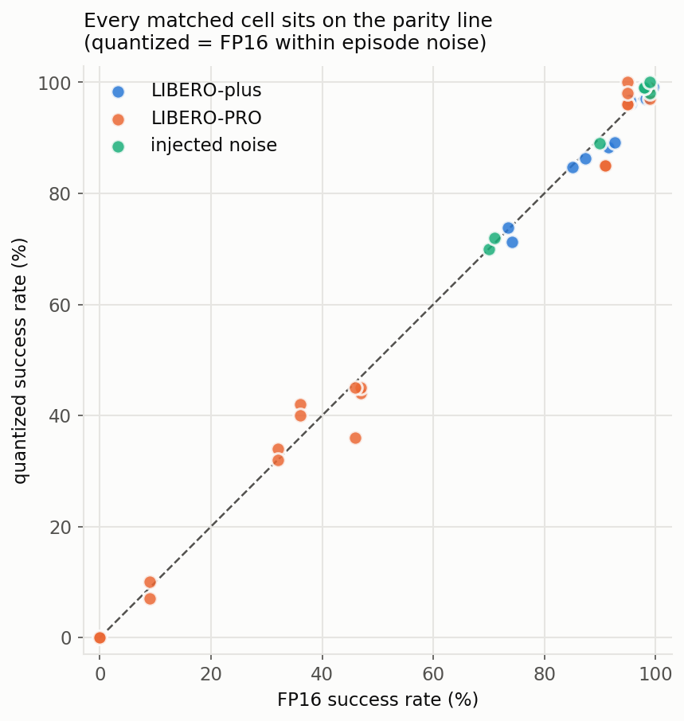
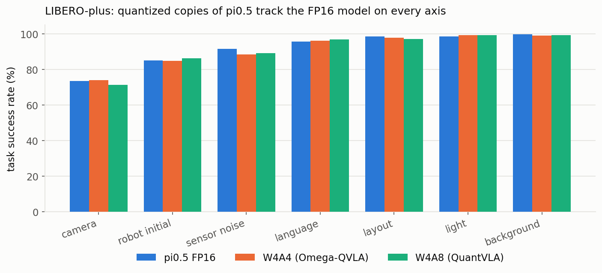
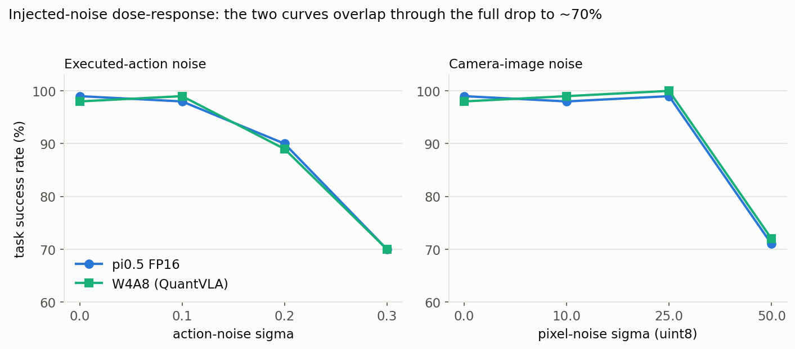

# Quantized VLA Robustness Bench

**How do post-training-quantized vision–language–action (VLA) policies behave
when the world is perturbed?** This repository records a set of controlled
measurements that put quantized copies of a VLA policy side by side with the
full-precision model across three families of perturbation: appearance/physical
nuisance shift (LIBERO-plus), semantic/compositional shift (LIBERO-PRO), and
injected action/pixel noise at graded doses.

The repository is descriptive. It reports success rates and shows the
full-precision and quantized curves next to each other. It does not argue a
thesis about quantization — the aim is simply to have a clean, reproducible
picture of how these models act under shift, on the ~26,000 episodes we ran.

---

## What was measured

| | |
|---|---|
| **Base policy** | pi0.5 (openpi, PyTorch), FP16 — used as the reference in every comparison |
| **Quantizers** | Omega-QVLA **W4A4** (GPTQ + composite rotation + per-step scales; 252 layers) · QuantVLA **W4A8** (selective layout + ATM/OHB; 180 layers) — both are released, near-lossless packs |
| **Native low-bit model** | BitVLA 3B — ternary {−1,0,1} LLM + 1.58-bit ViT, *trained* low-bit (secondary observation, no FP16 twin) |
| **Benchmarks** | LIBERO-plus (7 nuisance axes) · LIBERO-PRO (5 semantic axes × 2 suites) · injected action + pixel noise (dose–response) |
| **Scale** | ~26,000 evaluation episodes |

**Clean anchors.** Both quantized packs are near-lossless on clean LIBERO-spatial
(≈98% vs. 99% FP16), and QuantVLA reproduces its paper's clean number to the
decimal. This is the precondition for the whole comparison: any behavior seen
under shift is not an artifact of a quantizer that was already broken on clean
data.

---

## The picture in one figure

Every matched (FP16, quantized) cell — across all three benchmarks and both
quantizers — plotted against the parity line:



The points sit on the diagonal from a 0% floor to a 100% ceiling. Where the
full-precision model succeeds, the quantized copy succeeds; where it struggles,
the quantized copy struggles by the same amount.

---

## Results by benchmark

### 1. LIBERO-plus — appearance & physical nuisance shift
Seven axes (camera viewpoint, sensor noise, robot initial state, object layout,
language paraphrase, lighting, background), all perturbation variants of each
axis pooled. → **[docs/01_libero_plus.md](docs/01_libero_plus.md)**



Camera viewpoint is the only axis where the FP16 model is well off ceiling
(~74%), so it is the axis with the most room for the copies to diverge — and the
three arms land within ~3pp of each other there. The remaining six axes leave
FP16 at 85–99.6%, and the quantized arms stay with it.

### 2. LIBERO-PRO — semantic & compositional shift
Object swaps, scene-asset replacement, instruction paraphrase, object-appearance
swaps, and goal rewrites, on the spatial and goal suites.
→ **[docs/02_libero_pro.md](docs/02_libero_pro.md)**

The interesting rows here are base-model behaviors that the quantized copies
inherit unchanged: pi0.5 drops to ~30–47% under object swaps, and to 0–10% when
a task's goal is rewritten while the pixels stay fixed (reproducing the
LIBERO-PRO paper's headline that VLAs lean on the scene more than the
instruction). The W4A4 and W4A8 copies show the same floors and the same
mid-range scores.

### 3. Injected noise — dose–response
Zero-mean Gaussian noise on every executed action (RobustVLA σ grid) and on the
camera images (uint8 scale), on otherwise-clean scenes.
→ **[docs/03_injected_noise.md](docs/03_injected_noise.md)**



Both stressors drive a clean monotone descent from ~99% to ~70%, which confirms
the design has real statistical power. The FP16 and W4A8 curves overlap through
the whole descent, including a dead-even 70 vs. 70 at the strongest action
noise. (At that dose the two arms actually disagree on 9 of 10 individual tasks
by up to 30pp each and merely *sum* to the same total — the quantized model
behaves differently, it just does not succeed less often.)

### 4. BitVLA — a natively-trained 1-bit model (secondary observation)
BitVLA is not post-training quantized; it is trained ternary and has no FP16
twin, so it is shown as a cross-model drop curve, not a matched comparison.
→ **[docs/04_bitvla_native_lowbit.md](docs/04_bitvla_native_lowbit.md)**


Its robustness *shape* differs from pi0.5's: markedly more robust to camera
viewpoint, markedly less robust to language paraphrase and lighting. Included
here to mark the contrast between post-training quantization (which tracks the
FP16 model in this data) and native low-bit training (which does not). Seed-0,
four axes still pending — treat as provisional.

---

## How to read the numbers

- All numbers are **task success rates (%)**: the fraction of rollouts in which
  the robot reached the goal within the episode step limit.
- Δ columns are **FP16 − quantized**, in percentage points. They are shown so the
  two arms can be compared directly, not because a particular sign is expected.
- **Statistical scale.** Binomial standard error is ≈5pp at n=100 episodes and
  ≈2pp at n=376. LIBERO-plus episodes additionally cluster by base task (~10 per
  axis), so the episode-level confidence intervals in
  [data/libero_plus_per_seed.csv](data/libero_plus_per_seed.csv) are
  *anti-conservative* — true intervals are wider.

See **[docs/methodology.md](docs/methodology.md)** for the design decisions that
make the comparison fair (seeded flow-matching sampling, full-axis pooling,
released-pack-only, per-run integrity gates) and the four evaluation pitfalls
that were caught along the way.

---

## Repository layout

```
data/     curated result tables (CSV, one per benchmark)
docs/     per-benchmark write-ups + methodology
figures/  generated plots
scripts/  make_figures.py — regenerates every figure from data/
```

Regenerate the figures:

```bash
python3 scripts/make_figures.py     # needs pandas + matplotlib
```

## Scope

The measurements cover deployable, near-lossless, *released* 4-bit PTQ packs for
one model family (pi0.5) on LIBERO-derived benchmarks. LIBERO-plus uses the
spatial suite; arms added latest are seed-0 only. The record describes what
these packs do on these benchmarks; it is not a claim about aggressive or
poorly-calibrated quantization, which was deliberately excluded so that clean
parity could be a precondition.
