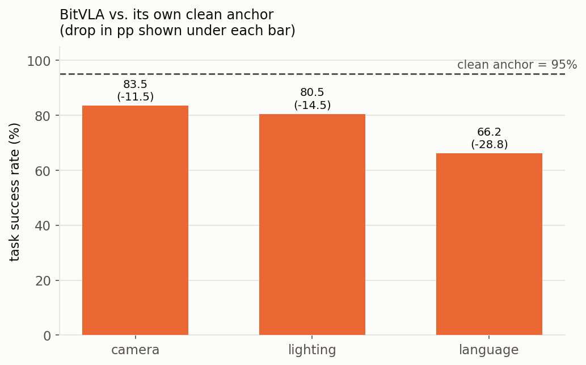

# BitVLA — a natively-trained 1-bit model (secondary observation)

**Model:** BitVLA 3B, LIBERO-spatial, seed 0 (**provisional** — four axes still
pending). **Data:** [`../data/bitvla_native_lowbit.csv`](../data/bitvla_native_lowbit.csv).

This section sits apart from the rest of the repository. BitVLA is **not**
post-training quantized: every LLM weight is trained ternary {−1,0,1} and the
vision encoder is 1.58-bit quantization-aware distilled. It has **no FP16 twin**,
so there is nothing to put it into a matched comparison against. It is reported
here purely on its own terms — how far each perturbation moves it from its own
clean performance.

At ~1.4 GB it is roughly 11× smaller than OpenVLA-OFT.

| condition | success rate | drop vs. clean |
|---|---:|---:|
| clean | 95.0 | — |
| camera (viewpoint) | 83.5 | −11.5 |
| lighting | 80.5 | −14.5 |
| language (paraphrase) | 66.2 | −28.8 |

`drop` = success rate − clean success rate.

## What it shows

Measured against its own clean anchor of 95%, BitVLA is affected unevenly by the
three perturbations completed so far:

- **Camera viewpoint** costs it 11.5pp — the mildest of the three.
- **Lighting** costs 14.5pp.
- **Language paraphrase** is the heaviest, at 28.8pp — roughly a third of its
  clean performance.

So the perturbations that move this natively-trained ternary model most are the
semantic/instruction ones (language), and the appearance one it tolerates best is
camera viewpoint.

## Caveats

Provisional: seed 0 only, four LIBERO-plus axes (sensor noise, layout, robot
initial, background) and the noise dose–response arms still pending. The three
axes above are the completed ones.
